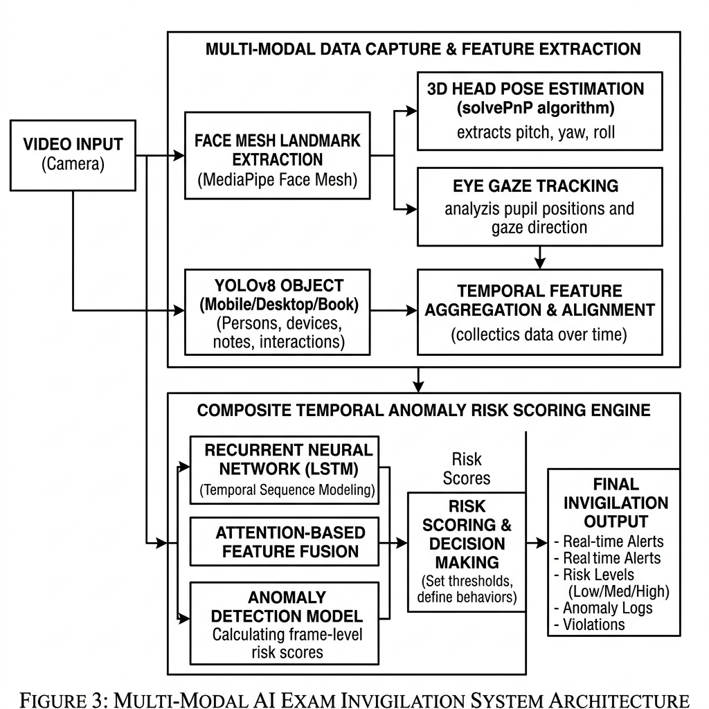

# The Silent Invigilator: Multi-Modal Real-Time Exam Surveillance using Deep Learning and Spatial-Temporal Anomaly Scoring

## Abstract

Surveillance of academic assessments is critical for maintaining academic integrity. However, manual invigilation is subject to human fatigue, cognitive overload, and subconscious bias. This repository presents **The Silent Invigilator**, an autonomous, non-intrusive exam invigilation system that integrates real-time computer vision, deep learning inference, and spatial-temporal anomaly scoring to monitor and flag suspicious candidate behavior. 

By fusing keypoint-based geometric tracking (gaze, head orientation, and facial structures) with object detection (YOLOv8) and student tracking (ByteTrack), the system constructs a multi-modal behavioral vector for each student. A temporal sliding-window risk accumulator filters transient physiological movements (such as blinking or natural adjustments) while registering persistent, high-confidence malpractice patterns. The system includes a dual deployment topology: a standalone, localized desktop runtime and a full-stack Flask-based dashboard for remote administration.

---

## System Architecture

The Silent Invigilator processes input video streams through a modular sequential pipeline. The frame processing pipeline is divided into three primary layers:

1. **Feature Extraction Layer**: Leverages Google MediaPipe Face Mesh, Hand Landmark, and Pose detection libraries to extract dense 3D facial geometry (468 landmarks), bilateral hand skeletons (21 landmarks per hand), and joint coordinates.
2. **Deep Learning Inference Layer**: Runs a lightweight YOLOv8 model for prohibited object detection (e.g., mobile phones) in parallel with an IoU-based tracking filter (ByteTrack) to identify and track multiple candidates.
3. **Heuristic and Scoring Layer**: Evaluates extracted geometric parameters against mathematical indicators, updates a sliding-window temporal queue, computes a composite anomaly score, and writes incidents asynchronously to an SQLite database.



---

## Algorithmic and Mathematical Formulation

### 1. 3D Head Pose Estimation (Perspective-n-Point)

To estimate head orientation in three-dimensional space without requiring dedicated depth sensors, the system solves the Perspective-n-Point (PnP) problem. Given a set of $n$ 3D facial reference points in world coordinates (based on an anthropometric model) and their corresponding 2D projections on the image plane, we define the camera projection matrix.

Let $P_w = [X_w, Y_w, Z_w, 1]^T$ be a 3D point in world coordinates, and $p = [u, v, 1]^T$ be its image projection. The pinhole camera model defines:

$$s \begin{bmatrix} u \\ v \\ 1 \end{bmatrix} = K [R \mid T] \begin{bmatrix} X_w \\ Y_w \\ Z_w \\ 1 \end{bmatrix}$$

Where:
* $s$ is an arbitrary scale factor.
* $K$ is the camera intrinsic matrix, initialized using the frame resolution boundaries and focal length approximation:
  $$K = \begin{bmatrix} f_x & 0 & c_x \\ 0 & f_y & c_y \\ 0 & 0 & 1 \end{bmatrix}$$
* $R \in SO(3)$ is the rotation matrix, and $T \in \mathbb{R}^3$ is the translation vector.

We compute $R$ and $T$ by minimizing the reprojection error using Levenberg-Marquardt optimization:

$$\min_{R, T} \sum_{i=1}^n \left\| p_i - \text{proj}(K, R, T, P_{w,i}) \right\|^2$$

The rotation matrix $R$ is decomposed into Euler angles representing Pitch ($\theta$), Yaw ($\psi$), and Roll ($\phi$) by calculating:

$$\theta = \arctan2\left(-R_{20}, \sqrt{R_{00}^2 + R_{10}^2}\right)$$
$$\psi = \arctan2(R_{10}, R_{00})$$
$$\phi = \arctan2(R_{21}, R_{22})$$

A violation is flagged if $|\theta| > \theta_{\text{max}}$ or $|\psi| > \psi_{\text{max}}$.

### 2. Eye Gaze Tracking (Iris Center Deviation)

Gaze tracking calculates the ratio of the iris center position relative to the horizontal boundaries of the eye. This index is robust against individual variations in eye shapes.

Let $L_{\text{inner}}$ and $L_{\text{outer}}$ denote the 2D pixel coordinates of the inner and outer eye corners (derived from landmarks 133 and 33 for the left eye, and 362 and 263 for the right eye). Let $I_{\text{center}}$ be the centroid of the iris boundary landmarks (468 to 472 for the left eye). The horizontal gaze ratio $\gamma$ is formulated as:

$$\gamma = \frac{\| I_{\text{center}} - L_{\text{inner}} \|_2}{\| L_{\text{outer}} - L_{\text{inner}} \|_2}$$

Where $\|\cdot\|_2$ denotes the Euclidean distance. The normalized gaze deviation $G_{\text{dev}}$ is defined as:

$$G_{\text{dev}} = \left| \gamma - \gamma_{\text{neutral}} \right|$$

Where $\gamma_{\text{neutral}} \approx 0.5$ represents the baseline when the subject looks straight ahead. A gaze aversion event is registered if $G_{\text{dev}} > G_{\text{max}}$.

### 3. Talking Detection (Mouth Aspect Ratio - MAR)

To detect oral communication (talking or reading aloud), the system measures the Mouth Aspect Ratio (MAR) over a sliding temporal window. 

Using the inner lip coordinates, let $p_1$ and $p_5$ represent the horizontal corner landmarks, and let $(p_2, p_8)$, $(p_3, p_7)$, and $(p_4, p_6)$ represent vertical landmark pairs across the upper and lower inner lips:

$$\text{MAR} = \frac{\| p_2 - p_8 \|_2 + \| p_3 - p_7 \|_2 + \| p_4 - p_6 \|_2}{2 \| p_1 - p_5 \|_2}$$

The raw MAR values are smoothed using an exponential moving average (EMA) to prevent false positives from brief facial expressions:

$$\text{MAR}_{\text{smoothed}, t} = \alpha_{\text{mar}} \cdot \text{MAR}_t + (1 - \alpha_{\text{mar}}) \cdot \text{MAR}_{\text{smoothed}, t-1}$$

A talking event is triggered if $\text{MAR}_{\text{smoothed}, t} > \text{MAR}_{\text{threshold}}$.

### 4. Prohibited Object Detection (YOLOv8 & SAHI)

For detecting unauthorized physical items (such as mobile phones), the system runs parallel YOLOv8 Nano inference. Let $I_f$ be the input frame of dimensions $W \times H$. The YOLO network outputs a set of bounding boxes $B = \{b_1, b_2, \dots, b_k\}$, where each box $b_i = (x_c, y_c, w, h, c, P_{\text{conf}})$:
* $(x_c, y_c)$ represents the box center coordinates.
* $(w, h)$ represents the width and height of the box.
* $c$ represents the class identifier (e.g., class 67 for "cell phone" in MS COCO).
* $P_{\text{conf}}$ represents the class probability.

To enhance small-object detection (such as a phone placed far from the camera lens), the system optionally integrates Slicing Aided Hyper Inference (SAHI). The frame $I_f$ is partitioned into overlapping grid slices of size $W_s \times H_s$ with an overlap ratio $\sigma$:

$$I_f = \bigcup_{m,n} S_{m,n}$$

Inference is executed on each slice independently, and predictions are aggregated using Non-Maximum Suppression (NMS) with an Intersection-over-Union (IoU) threshold $\beta_{\text{iou}}$ to resolve overlapping bounding box conflicts:

$$\text{IoU}(b_a, b_b) = \frac{\text{Area}(b_a \cap b_b)}{\text{Area}(b_a \cup b_b)}$$

### 5. Composite Spatial-Temporal Anomaly Scoring

Malpractice is rarely defined by a single instant of behavioral deviation. Therefore, the system calculates a composite, time-averaged anomaly score at each frame $t$.

Let $X_t \in \{0, 1\}^5$ be a binary indicator vector representing active alerts at frame $t$:
$$X_t = [I_{\text{phone}}, I_{\text{multiple\_faces}}, I_{\text{head\_pose}}, I_{\text{gaze}}, I_{\text{hand\_proximity}}]^T$$

We define a diagonal weight matrix $W$:
$$W = \text{diag}(w_{\text{phone}}, w_{\text{multiple\_faces}}, w_{\text{head\_pose}}, w_{\text{gaze}}, w_{\text{hand\_proximity}})$$

The instantaneous anomaly score $A_t$ is calculated as:

$$A_t = \min\left(100, \sum_{i=1}^5 W_{ii} X_{t,i}\right)$$

To filter out natural movements (such as looking down at a writing sheet), the system routes $A_t$ through a temporal sliding-window accumulator. Let $D_t$ be a FIFO queue containing the scores of the last $N$ frames (where $N$ corresponds to a 2-second buffer, approximately 60 frames):

$$D_t = \{A_{t-N+1}, A_{t-N+2}, \dots, A_t\}$$

The smoothed temporal anomaly score $S_t$ is the weighted mean of the sliding queue:

$$S_t = \sum_{k=0}^{N-1} \lambda^k A_{t-k} \Big/ \sum_{k=0}^{N-1} \lambda^k$$

Where $\lambda \in (0, 1]$ is a temporal decay parameter. When $S_t > \tau_{\text{alert}}$, a formal malpractice alert is logged to the backend and recorded in the database.

---

## Technical Stack and Components

The codebase is structured into three primary sub-systems:

```text
├── backend/
│   ├── app.py                # Flask Web API, websocket server, & dashboard router
│   ├── camera.py             # Multi-threaded frame grabber, MediaPipe wrappers, and YOLOv8 pipeline
│   ├── silent_invigilator.py # Standalone OpenCV GUI executable with logging utilities
│   ├── requirements.txt      # Core Python dependencies
│   ├── static/               # CSS styling sheets and JavaScript dashboard charts
│   └── templates/            # HTML structural layouts for the monitoring dashboard
```

### 1. Multi-Threaded Camera Interface (`camera.py`)
To prevent network request latency from dropping the frame rate of the ML pipeline, the camera interface runs on a separate thread. This thread continuously grabs frames from the hardware camera buffer and updates a shared memory location, allowing the main processor thread to query the latest frame asynchronously.

### 2. Standalone Application (`silent_invigilator.py`)
A self-contained Python application that opens an OpenCV window showing the camera stream with HUD overlays. It records the session, computes risk thresholds, and writes a structural JSON report on exit.

### 3. Web Dashboard (`app.py`)
A Flask web server that handles real-time MJPEG video streaming. It exposes JSON endpoints for real-time telemetry (anomaly graphs, active violations, and total counts) and displays a Brutalist-style dashboard for invigilators.

---

## Installation and Deployment

### Prerequisites

* Python 3.10 or higher
* Pip (Python Package Installer)
* C++ Build Tools (required for specific dependency compilations under Windows)
* Webcam or network-attached IP camera

### Step-by-Step Setup

1. **Clone the Repository** and navigate to the project directory:
   ```bash
   cd silent-invigilator
   ```

2. **Initialize a Virtual Environment**:
   ```bash
   python -m venv .venv
   ```

3. **Activate the Environment**:
   * **Windows (PowerShell)**:
     ```powershell
     .venv\Scripts\Activate.ps1
     ```
   * **Linux / macOS**:
     ```bash
     source .venv/bin/activate
     ```

4. **Install Dependencies**:
   ```bash
   cd backend
   pip install -r requirements.txt
   ```

---

## Execution Guide

### 1. Running the Standalone Desktop Application
To launch the OpenCV-based desktop window, run the following:

```bash
cd backend
python silent_invigilator.py
```

* Press **Q** to exit and write the database/JSON logs.
* Press **R** to reset active scores.
* Press **S** to save an intermediate snapshot.

### 2. Running the Flask Web Dashboard
To start the web server and view the dashboard in a web browser:

```bash
cd backend
python app.py
```

Open a web browser and navigate to `http://127.0.0.1:5000`. The interface will display a real-time graph of the candidate's anomaly score, active alerts, and an annotated video feed.

---

## Configuration and Parameter Tuning

All system thresholds can be customized in the configuration dictionary within the `VideoCamera` class (`camera.py`) or `SilentInvigilator` class (`silent_invigilator.py`):

```python
self.thresholds = {
    'head_yaw_max': 30,          # Maximum allowable yaw rotation (degrees)
    'head_pitch_max': 25,        # Maximum allowable pitch rotation (degrees)
    'gaze_deviation_max': 0.06,  # Maximum normalized horizontal gaze deviation
    'sustained_look_away_frames': 45, # Duration before an alert is triggered (~1.5s)
    'phone_confidence': 0.50,    # Minimum confidence score for YOLO phone detection
    'multiple_faces_frames': 15, # Frame threshold for multiple face alerts (~0.5s)
}
```

### Parameter Scoring Weights
Weights are located in the anomaly scoring function:
* Phone Detection: **+50 points**
* Multiple Face Detection: **+40 points**
* Out-of-bounds Head Rotation: **+25 points**
* Eye Gaze Aversion: **+15 points**

---

## Performance Optimization

To achieve real-time performance on lower-tier hardware (e.g., integrated GPUs or older CPUs):

1. **Limit Resolution**: Initialize the video capture stream at $640 \times 480$ rather than $1280 \times 720$.
2. **Frame Skipping**: Modify the main loops to perform YOLOv8 inferences only once every $N$ frames (e.g., $N=15$), while using MediaPipe landmark interpolation for the intermediate frames.
3. **Hardware Acceleration**: If an NVIDIA GPU is available, install CUDA-supported PyTorch to accelerate YOLOv8 model evaluations:
   ```bash
   pip install torch torchvision --index-url https://download.pytorch.org/whl/cu118
   ```

---

## References and Acknowledgements

* **Google MediaPipe**: Keypoint tracking and landmark geometries.
* **Ultralytics YOLOv8**: Object detection framework.
* **OpenCV**: Open-source Computer Vision library.
* **solvePnP**: Perspective-n-Point pose calculation method.
