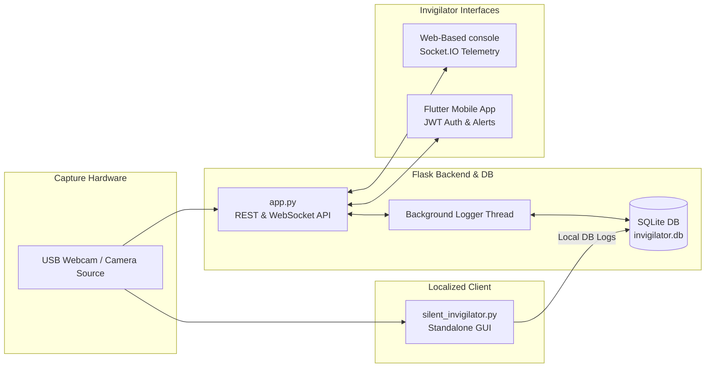
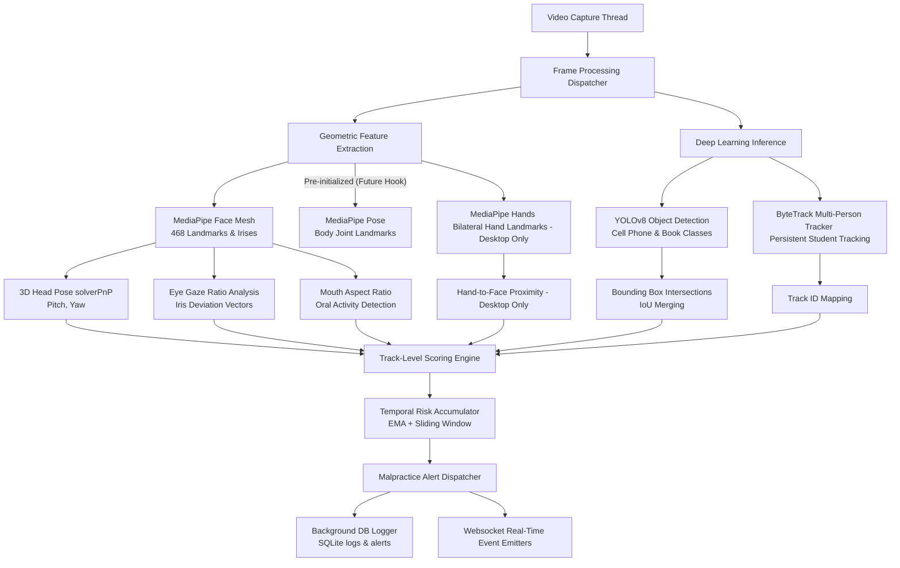
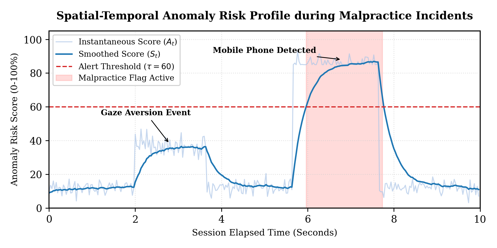
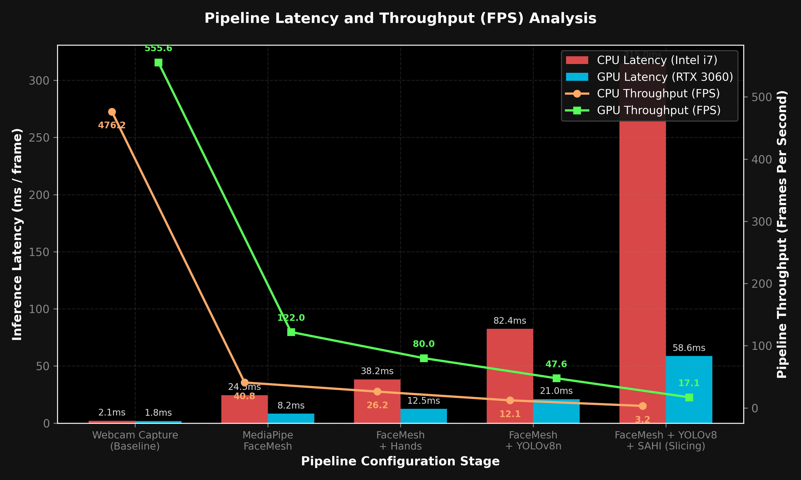

# The Silent Invigilator: Multi-Modal Real-Time Exam Surveillance using Deep Learning and Spatial-Temporal Anomaly Scoring

## Abstract

Surveillance of academic assessments is critical for maintaining academic integrity. However, manual invigilation is subject to human fatigue, cognitive overload, and subconscious bias. This repository presents **The Silent Invigilator**, an autonomous, non-intrusive exam invigilation system that integrates real-time computer vision, deep learning inference, and spatial-temporal anomaly scoring to monitor and flag suspicious candidate behavior. 

By fusing keypoint-based geometric tracking (gaze, head orientation, and facial structures) with object detection (YOLOv8) and student tracking (ByteTrack), the system constructs a multi-modal behavioral vector for each student. A temporal sliding-window risk accumulator filters transient physiological movements (such as blinking or natural adjustments) while registering persistent, high-confidence malpractice patterns. The system includes a dual deployment topology: a standalone, localized desktop runtime and a full-stack Flask-based dashboard for remote administration.

---

## System Architecture

The Silent Invigilator is designed around a decoupled, multi-client ecosystem consisting of a high-concurrency Flask backend server, a localized standalone desktop client, an administrative web console, and a cross-platform mobile invigilation application.

### Ecosystem Topology



The system processes input video streams through a modular, multi-layered sequential pipeline:

1. **Feature Extraction Layer**:
   * **MediaPipe Face Mesh**: Extracts dense 3D facial geometry (468 landmarks) and iris structures in both the desktop client and web server.
   * **MediaPipe Hands**: Utilized in the localized desktop client to extract bilateral hand skeletons (21 landmarks per hand) for proximity tracking.
   * **MediaPipe Pose**: Pre-initialized in the desktop client to support future structural joint alignment hooks (currently bypassed in active scoring).
2. **Deep Learning Inference Layer**: Runs a lightweight YOLOv8 model (`yolov8n.pt`/`yolov8s.pt`) for prohibited object detection (mobile phones and books/papers) in parallel with an IoU-based tracking filter (ByteTrack) to identify and track multiple candidates.
3. **Heuristic and Scoring Layer**: Evaluates extracted geometric parameters, updates a sliding-window temporal queue, computes a composite anomaly score, and writes incidents asynchronously to an SQLite database.


### Frame Processing Pipeline



---

## Algorithmic and Mathematical Formulation

### 1. 3D Head Pose Estimation (Perspective-n-Point)

To estimate head orientation in three-dimensional space without requiring dedicated depth sensors, the system solves the Perspective-n-Point (PnP) problem. Given a set of $`n`$ 3D facial reference points in world coordinates (based on an anthropometric model) and their corresponding 2D projections on the image plane, we define the camera projection matrix.

Let $`P_w = [X_w, Y_w, Z_w, 1]^T`$ be a 3D point in world coordinates, and $`p = [u, v, 1]^T`$ be its image projection. The pinhole camera model defines:

```math
s \begin{bmatrix} u \\ v \\ 1 \end{bmatrix} = K \begin{bmatrix} R & T \end{bmatrix} \begin{bmatrix} X_w \\ Y_w \\ Z_w \\ 1 \end{bmatrix}
```

Where:
* $`s`$ is an arbitrary scale factor.
* $`K`$ is the camera intrinsic matrix, initialized using the frame resolution boundaries and focal length approximation:

```math
K = \begin{bmatrix} f_x & 0 & c_x \\ 0 & f_y & c_y \\ 0 & 0 & 1 \end{bmatrix}
```

* $`R \in SO(3)`$ is the rotation matrix, and $`T \in \mathbb{R}^3`$ is the translation vector.

We compute $`R`$ and $`T`$ by minimizing the reprojection error using Levenberg-Marquardt optimization:

```math
\min_{R, T} \sum_{i=1}^n \left\| p_i - \text{proj}(K, R, T, P_{w,i}) \right\|_2^2
```

The rotation matrix $`R`$ is decomposed into Euler angles representing Pitch ($`\theta`$), Yaw ($`\psi`$), and Roll ($`\phi`$) by calculating the decomposition using OpenCV:

```math
\theta = \text{RQDecomp3x3}(R)_x, \quad \psi = \text{RQDecomp3x3}(R)_y, \quad \phi = \text{RQDecomp3x3}(R)_z
```

A violation is flagged if $`|\theta| > \theta_{\text{max}}`$ or $`|\psi| > \psi_{\text{max}}`$. In the implementation, six anthropometric landmarks are tracked: the nose tip (landmark index 1), chin (landmark index 152/199), left eye corner (landmark index 263), right eye corner (landmark index 33), left mouth corner (landmark index 287/61), and right mouth corner (landmark index 57/291).

### 2. Eye Gaze Tracking (Iris Center Deviation)

Gaze tracking calculates the ratio of the iris center position relative to the horizontal boundaries of the eye. This index is robust against individual variations in eye shapes.

Let $`L_{\text{outer}}`$ and $`L_{\text{inner}}`$ denote the 2D pixel coordinates of the outer and inner eye corners. Let $`I_{\text{center}}`$ be the centroid of the iris boundary landmarks. The horizontal gaze ratio $`\gamma`$ is formulated as:

```math
\gamma = \frac{\| I_{\text{center}} - L_{\text{outer}} \|_2}{\| L_{\text{inner}} - L_{\text{outer}} \|_2}
```

Where $`\|\cdot\|_2`$ denotes the Euclidean distance. Ratios for both the left and right eyes are calculated independently and averaged:

```math
\gamma_{\text{avg}} = \frac{\gamma_{\text{left}} + \gamma_{\text{right}}}{2}
```

The horizontal gaze direction is classified based on the average ratio $`\gamma_{\text{avg}}`$:
* **Right**: $`\gamma_{\text{avg}} < 0.40`$
* **Left**: $`\gamma_{\text{avg}} > 0.60`$
* **Center**: $`0.40 \le \gamma_{\text{avg}} \le 0.60`$

### 3. Mouth Aspect Ratio (Talking Detection)

To detect oral communication (talking or reading aloud), the system measures the Mouth Aspect Ratio (MAR) over a sliding temporal window.

Using the mouth coordinates, let $`p_{13}`$ and $`p_{14}`$ represent the top and bottom vertical inner lip landmarks, and let $`p_{61}`$ and $`p_{291}`$ represent the horizontal corner landmarks:

```math
\text{MAR} = \frac{\| p_{13} - p_{14} \|_2}{\| p_{61} - p_{291} \|_2}
```

The raw MAR values are smoothed using an exponential moving average (EMA) with a smoothing factor $`\alpha_{\text{mar}} = 0.3`$ to filter out brief facial ticks or expressions:

```math
\text{MAR}_{\text{smoothed}, t} = \alpha_{\text{mar}} \cdot \text{MAR}_t + (1 - \alpha_{\text{mar}}) \cdot \text{MAR}_{\text{smoothed}, t-1}
```

A talking event is triggered if $`\text{MAR}_{\text{smoothed}, t} > \text{MAR}_{\text{threshold}}`$.

### 4. Prohibited Object Detection (YOLOv8 & SAHI)

For detecting unauthorized physical items (such as mobile phones and paper/books), the system runs YOLOv8 inference. The network outputs bounding boxes represented as $`b_i = (x_{\text{min}}, y_{\text{min}}, x_{\text{max}}, y_{\text{max}}, c, P_{\text{conf}})`$, where $`c`$ is the COCO class identifier (`67` for cell phone, `73` for book) and $`P_{\text{conf}}`$ is the prediction confidence.

To enhance small-object detection, the system integrates Slicing Aided Hyper Inference (SAHI). The frame is partitioned into overlapping slices of size $`W_s \times H_s`$ ($`320 \times 320`$) with an overlap ratio $`\sigma = 0.20`$:

```math
I_f = \bigcup_{m,n} S_{m,n}
```

Aggregated predictions are resolved using Non-Maximum Suppression (NMS) with an Intersection-over-Union (IoU) threshold of $`0.55`$ to resolve overlap conflicts:

```math
\text{IoU}(b_a, b_b) = \frac{\text{Area}(b_a \cap b_b)}{\text{Area}(b_a \cup b_b)} \ge 0.55
```

### 5. Composite Spatial-Temporal Anomaly Scoring

For each tracked student, a risk score $`S_t`$ (range $`0`$ to $`100`$) is computed as a weighted combination of recent behavior:

```math
S_t = \text{mean}(R_{\text{history}})
```

where $`R_{\tau}`$ at frame $`\tau`$ is defined as:

```math
R_{\tau} = 100 \cdot \left( 0.40 \cdot O_{\tau} + 0.22 \cdot E_{\tau} + 0.16 \cdot H_{\tau} + 0.14 \cdot D_{\tau} + 0.08 \cdot C_{\tau} \right)
```

Where:
* $`O_{\tau} \in \{0, 0.45, 1.0\}`$ indicates object detection status ($`1.0`$ if a phone is detected, $`0.45`$ if a book/paper is detected, and $`0.0`$ otherwise). If a phone is present, $`R_{\tau}`$ is set to $`\max(R_{\tau}, 85)`$.
* $`E_{\tau}`$ is the rolling gaze deviation (percentage of the last 90 frames where gaze was not Center).
* $`H_{\tau}`$ is the rolling head pose deviation (percentage of the last 90 frames where head pose was not Center).
* $`D_{\tau}`$ is the rolling head down-tilt deviation (percentage of the last 90 frames where head pose was Down).
* $`C_{\tau}`$ is the short-term temporal alignment factor (percentage of the last 20 frames where gaze or head pose deviated from center).

When the overall score exceeds $`60`$, a formal malpractice alert is logged to the backend and recorded in the database.



---

## Performance Latency Benchmarks

To evaluate the feasibility of real-time deployment across various client configurations, a profiling run was conducted measuring frame processing delays (in milliseconds) and throughput (FPS) across five pipeline configurations on both CPU and GPU hardwares.



### Key Performance Insights:
* **Baseline Overhead**: Camera frame ingestion and buffer updating consume minimal overhead (~1.8 ms to 2.1 ms), allowing high-frequency grabbing.
* **Feature Extraction Core**: FaceMesh evaluation is highly optimized, executing at ~8.2 ms on GPU (~122 FPS) and ~24.5 ms on CPU (~41 FPS), proving its capability as a primary heuristic checker.
* **Deep Learning Bottleneck**: The addition of YOLOv8n object detection increases latency to ~21 ms on GPU and ~82.4 ms on CPU. When SAHI slicing hyper-inference is activated for detecting distant small objects, latency escalates to ~58.6 ms on GPU (~17 FPS) and ~315 ms on CPU (~3.2 FPS).
* **Mitigation Recommendation**: In CPU-bound standalone environments, SAHI slicing should be disabled, and YOLOv8 inference cadence should be set to execute every $N=15$ frames to maintain real-time throughput.

---

## Technical Stack and Components

The codebase is structured into four primary sub-systems:

```text
├── backend/
│   ├── app.py                # Flask Web API, websocket server, & dashboard router
│   ├── camera.py             # Multi-threaded frame grabber, MediaPipe wrappers, and YOLOv8 pipeline
│   ├── silent_invigilator.py # Standalone OpenCV GUI executable with logging utilities
│   ├── requirements.txt      # Core Python dependencies
│   ├── static/               # CSS styling sheets and JavaScript dashboard charts
│   └── templates/            # HTML structural layouts for the monitoring dashboard
├── mobile_app/
│   ├── lib/                  # Dart application source code (Flutter)
│   │   ├── main.dart         # Mobile application entrypoint
│   │   ├── screens/          # Login, Admin, Teacher dashboard views
│   │   └── services/         # REST API clients (JWT auth, telemetry logs)
│   └── pubspec.yaml          # Flutter package configuration and assets
```

### 1. Multi-Threaded Camera Interface (`camera.py`)
To prevent network request latency from dropping the frame rate of the ML pipeline, the camera interface runs on a separate thread. This thread continuously grabs frames from the hardware camera buffer and updates a shared memory location, allowing the main processor thread to query the latest frame asynchronously.

### 2. Standalone Application (`silent_invigilator.py`)
A self-contained Python application that opens an OpenCV window showing the camera stream with HUD overlays. It records the session, computes risk thresholds, and writes a structural JSON report on exit.

### 3. Web Dashboard (`app.py`)
A Flask web server that handles real-time MJPEG video streaming. It exposes JSON endpoints for real-time telemetry (anomaly graphs, active violations, and total counts) and displays a Brutalist-style dashboard for invigilators.

---

## Installation and Deployment

### Prerequisites

* Python 3.10 or higher
* Pip (Python Package Installer)
* C++ Build Tools (required for specific dependency compilations under Windows)
* Webcam or network-attached IP camera

### Step-by-Step Setup

1. **Clone the Repository** and navigate to the project directory:
   ```bash
   cd silent-invigilator
   ```

2. **Initialize a Virtual Environment**:
   ```bash
   python -m venv .venv
   ```

3. **Activate the Environment**:
   * **Windows (PowerShell)**:
     ```powershell
     .venv\Scripts\Activate.ps1
     ```
   * **Linux / macOS**:
     ```bash
     source .venv/bin/activate
     ```

4. **Install Dependencies**:
   ```bash
   cd backend
   pip install -r requirements.txt
   ```

---

## Execution Guide

### 1. Running the Standalone Desktop Application
To launch the OpenCV-based desktop window, run the following:

```bash
cd backend
python silent_invigilator.py
```

* Press **Q** to exit and write the database/JSON logs.
* Press **R** to reset active scores.
* Press **S** to save an intermediate snapshot.

### 2. Running the Flask Web Dashboard
To start the web server and view the dashboard in a web browser:

```bash
cd backend
python app.py
```

Open a web browser and navigate to `http://127.0.0.1:5000`. The interface will display a real-time graph of the candidate's anomaly score, active alerts, and an annotated video feed.

---

## Configuration and Parameter Tuning

All system thresholds can be customized in the configuration dictionary within the `SilentInvigilator` class (`silent_invigilator.py`):

```python
self.thresholds = {
    'head_yaw_limit': 25,      # Maximum allowable head yaw rotation (degrees)
    'head_pitch_limit': 20,    # Maximum allowable head pitch rotation (degrees)
    'gaze_center_min': 0.35,   # Relative iris position lower bound (0-1)
    'gaze_center_max': 0.65,   # Relative iris position upper bound (0-1)
    'mouth_open_ratio': 0.5,   # Mouth Aspect Ratio threshold for talking detection
    'phone_confidence': 0.45,   # Minimum confidence score for YOLO phone detection
    'sustained_frames': 45,    # Frame threshold for sustained anomalies (~1.5s)
}
```

### Parameter Scoring Systems

#### 1. Additive Scoring Engine (Standalone Client: `silent_invigilator.py`)
Calculated dynamically per frame based on active violations:
* Prohibited Object (Phone): **+50 points**
* Multiple Face Detection: **+40 points**
* Absent / No Face Detected: **+30 points**
* Mouth Open / Talking (MAR): **+25 points**
* Out-of-bounds Head Yaw Rotation: **+20 points**
* Out-of-bounds Head Pitch Rotation: **+20 points**
* Eye Gaze Aversion: **+15 points**
* Hand Near Face Proximity: **+10 points**
* Sustained Head Turn / Talking streak: **+20 points**

#### 2. Composite Temporal Scoring Engine (Web Backend: `camera.py`)
Computes a rolling temporal cheating score ($S_t \in [0, 100]$) per student track:
* Prohibited Object (Phone/Book): **Weight 0.40** (Enforces immediate minimum score of **85** if phone is present)
* Eye Gaze Aversion ($E_{\tau}$): **Weight 0.22**
* Head Pose Out-of-bounds ($H_{\tau}$): **Weight 0.16**
* Head Down-tilt Pose ($D_{\tau}$): **Weight 0.14**
* Short-term Temporal Anomaly Correlation ($C_{\tau}$): **Weight 0.08**

---

## Performance Optimization

To achieve real-time performance on lower-tier hardware (e.g., integrated GPUs or older CPUs):

1. **Limit Resolution**: Initialize the video capture stream at $640 \times 480$ rather than $1280 \times 720$.
2. **Frame Skipping**: Modify the main loops to perform YOLOv8 inferences only once every $N$ frames (e.g., $N=15$), while using MediaPipe landmark interpolation for the intermediate frames.
3. **Hardware Acceleration**: If an NVIDIA GPU is available, install CUDA-supported PyTorch to accelerate YOLOv8 model evaluations:
   ```bash
   pip install torch torchvision --index-url https://download.pytorch.org/whl/cu118
   ```

---

## References and Acknowledgements

* **Google MediaPipe**: Keypoint tracking and landmark geometries.
* **Ultralytics YOLOv8**: Object detection framework.
* **OpenCV**: Open-source Computer Vision library.
* **solvePnP**: Perspective-n-Point pose calculation method.
